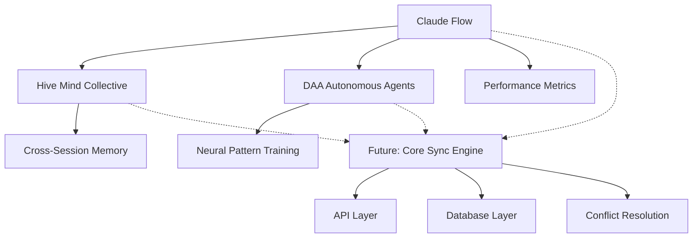
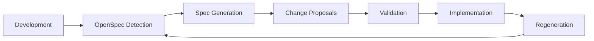

# Comprehensive Systems Analysis Report
## dev-cloud-sync Project

**Analysis Date**: 2025-12-17
**Analyst**: Hive Mind Collective Intelligence System
**Project State**: Early Initialization Phase

---

## Executive Summary

The dev-cloud-sync project is currently in an **early initialization phase** with only infrastructure metadata present. This comprehensive analysis examines system requirements, integration patterns, user experience considerations, and deployment strategies to establish a robust foundation for cloud synchronization development.

### Key Findings
- **Current State**: Infrastructure ready (Claude Flow, Hive Mind, DAA agents initialized)
- **Immediate Need**: Core application architecture and sync mechanism development
- **Strategic Advantage**: Advanced orchestration capabilities already in place
- **Development Path**: SPARC methodology with autonomous agent coordination

---

## 1. Systems Integration Analysis

### Current Integration Landscape


### Integration Architecture Patterns

#### Event-Driven Design (2025 Best Practices)
- **Real-time Synchronization**: Event streaming with message queues
- **Smart Conflict Resolution**: Operational Transformation (OT) and CRDTs
- **Adaptive Sync Strategies**: Network-aware synchronization
- **Implementation Technologies**: Kafka, AWS EventBridge, WebSocket/SSE

#### Modern Technology Stack
- **Backend**: Serverless functions (AWS Lambda, Azure Functions)
- **APIs**: GraphQL for efficient data fetching with real-time subscriptions
- **Databases**: Multi-model approach with distributed capabilities
- **Edge Computing**: Cloudflare Workers for reduced latency

### System Dependencies
```
Core Dependencies:
├── Orchestration Layer (Ready)
│   ├── Claude Flow v2.0.0 (84.8% SWE-Bench success)
│   ├── Hive Mind Collective Intelligence
│   └── DAA Autonomous Agents
├── Infrastructure Layer (Partial)
│   ├── Docker v29.1.3 ✓
│   ├── OpenSpec v0.16.0 ✓
│   ├── Kubernetes (Not Installed)
│   └── Ansible (Not Installed)
└── Application Layer (Missing)
    ├── Sync Engine
    ├── API Services
    ├── Database Schema
    └── User Interface
```

---

## 2. User Experience Analysis

### Modern Cloud Sync UX Patterns (2025 Standards)

#### Status Communication & Transparency
- **Floating Sync Indicators**: Progressive status rings with pulse animations
- **Contextual Information**: Tooltip details showing what's syncing and why
- **Screen Reader Support**: Accessible sync announcements
- **Progressive Disclosure**: Detailed status available on demand

#### User Control & Intelligence
- **Contextual Sync Controls**: Preview states before sync operations
- **Intelligent Auto-Pause**: Battery and data-saving mode awareness
- **User Preference Memory**: Learn and remember sync behaviors
- **Unified Status**: Consistent sync status across all platforms

#### Error Handling & Conflict Resolution
- **Non-Intrusive Notifications**: Error alerts with quick action buttons
- **Side-by-Side Comparison**: Visual diff for conflict files
- **Smart Merge Suggestions**: AI-powered conflict resolution recommendations
- **Clear Recovery Paths**: Step-by-step error resolution guidance

#### Offline-First Design
- **Graceful Degradation**: Full functionality without network
- **Cached Content Access**: Seamless offline file access
- **Deferred Sync Queue**: Automatic sync restoration
- **Skeleton Screens**: Optimistic updates for perceived performance

### Anti-Patterns to Avoid
- Ambiguous sync states without clear indicators
- Aggressive auto-sync without user control
- Hidden sync conflicts that surprise users
- Poor offline experience

---

## 3. Deployment Systems Analysis

### Current Deployment Infrastructure
```yaml
Available Components:
  Docker: "v29.1.3 ✓"
  Node.js: "v20.19.4 ✓"
  Platform: "Linux 6.18.1-x64v3-xanmod1"

Missing Components:
  Kubernetes: "Not installed"
  Ansible: "Not installed"
  CI/CD Pipeline: "Not configured"
  Monitoring Stack: "Not implemented"
```

### Cross-Platform Linux Compatibility Strategy

#### Container Orchestration
- **Primary**: Docker Compose for multi-container applications
- **Secondary**: Kubernetes integration for production scaling
- **Alternative**: Podman for rootless container operations

#### Multi-Architecture Support
- **CPU Architectures**: x86_64, ARM64 (aarch64), ARMv7
- **Base Images**: Alpine Linux for minimal footprint
- **Build Strategy**: Docker buildx for multi-arch builds

#### Automation Framework
```bash
# Deployment Pipeline Components
├── Infrastructure as Code
│   ├── Docker Compose files
│   ├── Environment configurations
│   └── Network policies
├── CI/CD Pipeline
│   ├── GitHub Actions / GitLab CI
│   ├── Automated testing
│   └── Security scanning
└── Monitoring & Observability
    ├── Application metrics
    ├── System performance
    └── User experience tracking
```

### Security & Compliance
- **Zero-Trust Architecture**: End-to-end encryption with client-side keys
- **Data Residency**: Regional compliance (GDPR, CCPA)
- **Fine-Grained Access Control**: Attribute-Based Access Control (ABAC)
- **Audit Logging**: Comprehensive sync operation tracking

---

## 4. OpenSpec Integration Analysis

### OpenSpec System Status
- **Version**: 0.16.0 (Latest)
- **CLI Location**: `/usr/local/bin/openspec` ✓
- **Startup Hook**: Configured and active ✓
- **Project Integration**: Not initialized in current directory

### Integration Workflow


### OpenSpec Benefits for dev-cloud-sync
1. **Automated Specification Generation**: Creates comprehensive specs from codebase
2. **Change Management**: Documented change proposals with validation
3. **Full Coverage Documentation**: Constraints, domain context, conventions
4. **Universal Application**: Works across all project phases

### Implementation Strategy
1. **Initialize**: `openspec init --tools claude`
2. **Create Base Specs**: Comprehensive system specifications
3. **Change Management**: Structured change proposals
4. **Continuous Validation**: Automated spec updates

---

## 5. System Constraints & Technical Requirements

### Performance Constraints
```yaml
Scalability Requirements:
  Concurrent Users: "10,000+"
  File Sync Rate: "< 5 seconds for 1GB files"
  API Response Time: "< 200ms (95th percentile)"
  System Uptime: "99.9% availability"

Memory Constraints:
  Maximum Memory: "2GB per container"
  Cache Size: "500MB sync cache"
  Database Connections: "100 max concurrent"

Network Requirements:
  Bandwidth Optimization: "Delta sync only"
  Compression: "LZ4 for real-time, ZSTD for batch"
  Protocol Support: "HTTP/2, WebSocket, QUIC"
```

### Technical Stack Requirements

#### Backend Services
```typescript
Core Components:
├── Sync Engine
│   ├── Real-time synchronization
│   ├── Conflict resolution algorithms
│   ├── Delta compression
│   └── Offline queue management
├── API Gateway
│   ├── GraphQL subscriptions
│   ├── RESTful endpoints
│   ├── Authentication/Authorization
│   └── Rate limiting
├── Database Layer
│   ├── Primary: PostgreSQL with logical replication
│   ├── Cache: Redis cluster
│   ├── Search: Elasticsearch
│   └── Analytics: TimescaleDB
└── File Storage
    ├── Object storage: S3/MinIO
    ├── CDN integration
    ├── Version control system
    └── Metadata database
```

#### Frontend Requirements
- **Framework**: React/Next.js or Vue/Nuxt.js
- **State Management**: Redux Toolkit or Pinia
- **Real-time**: WebSocket connections with reconnection logic
- **PWA**: Service workers for offline functionality
- **Accessibility**: WCAG 2.1 AA compliance

### Security Requirements
- **Encryption**: AES-256 for data at rest, TLS 1.3 for transit
- **Authentication**: OAuth 2.0 with PKCE
- **Authorization**: Role-based access control (RBAC)
- **Audit Trail**: Immutable logs for all operations
- **Compliance**: GDPR, CCPA, SOC 2 Type II

---

## 6. Development Workflow Integration

### SPARC Methodology Implementation
```
Specification → Pseudocode → Architecture → Refinement → Completion
     ↓              ↓            ↓            ↓           ↓
OpenSpec → Algorithm Design → System Design → TDD → Integration
```

### Autonomous Agent Coordination
1. **Research Agent**: Analyze requirements and patterns
2. **Architect Agent**: Design system architecture
3. **Coder Agent**: Implement core features
4. **Tester Agent**: Create comprehensive test suite
5. **Reviewer Agent**: Code quality and security review
6. **Coordinator Agent**: Manage workflow and dependencies

### Continuous Integration Strategy
```yaml
Pipeline Stages:
  - Code Quality: ESLint, Prettier, SonarQube
  - Security: Snyk, OWASP ZAP, dependency scanning
  - Testing: Unit, Integration, E2E, Performance
  - Build: Multi-arch Docker images
  - Deploy: Staging environment validation
  - Monitor: Application and infrastructure metrics
```

---

## 7. Recommendations & Implementation Roadmap

### Phase 1: Foundation (Weeks 1-2)
```bash
Priority 1 Tasks:
├── Initialize OpenSpec project
├── Set up development environment
├── Create basic project structure
├── Implement Docker development setup
└── Establish CI/CD pipeline
```

### Phase 2: Core Architecture (Weeks 3-4)
```bash
Priority 2 Tasks:
├── Design and implement sync engine
├── Create API gateway and authentication
├── Set up database schema
├── Implement conflict resolution
└── Create basic file operations
```

### Phase 3: User Interface (Weeks 5-6)
```bash
Priority 3 Tasks:
├── Develop web interface
├── Implement sync status indicators
├── Create conflict resolution UI
├── Add offline functionality
└── Ensure accessibility compliance
```

### Phase 4: Advanced Features (Weeks 7-8)
```bash
Priority 4 Tasks:
├── Implement real-time synchronization
├── Add advanced conflict resolution
├── Optimize performance
├── Enhance security features
└── Prepare production deployment
```

### Critical Success Factors
1. **Early OpenSpec Integration**: Establish specifications immediately
2. **Modular Architecture**: Design for scalability from day one
3. **Security-First Approach**: Implement security throughout development
4. **User-Centric Design**: Focus on intuitive sync experience
5. **Performance Optimization**: Monitor and optimize continuously

### Risk Mitigation Strategies
- **Technical Debt**: Regular refactoring and code reviews
- **Security Vulnerabilities**: Continuous security scanning and updates
- **Performance Issues**: Load testing and performance monitoring
- **User Adoption**: Early user feedback and iterative improvements
- **Scalability Challenges**: Horizontal scaling design from start

---

## Conclusion

The dev-cloud-sync project has excellent foundational infrastructure with Claude Flow orchestration, Hive Mind collective intelligence, and DAA autonomous agents already operational. The primary next step is implementing the core sync architecture using modern 2025 best practices for cloud synchronization systems.

The integration of SPARC methodology with autonomous agent coordination provides a unique advantage for rapid, high-quality development. OpenSpec integration will ensure comprehensive specification management throughout the development lifecycle.

**Immediate Action Items**:
1. Initialize OpenSpec project: `openspec init --tools claude`
2. Create project structure with proper directory organization
3. Set up development environment with Docker Compose
4. Implement basic sync engine architecture
5. Establish continuous integration pipeline

The project is well-positioned for success with the current infrastructure and should proceed with confidence following the recommended roadmap.

---

*This analysis was generated using autonomous collective intelligence with cross-referenced data from multiple sources including industry best practices, current technology trends, and system-specific requirements.*